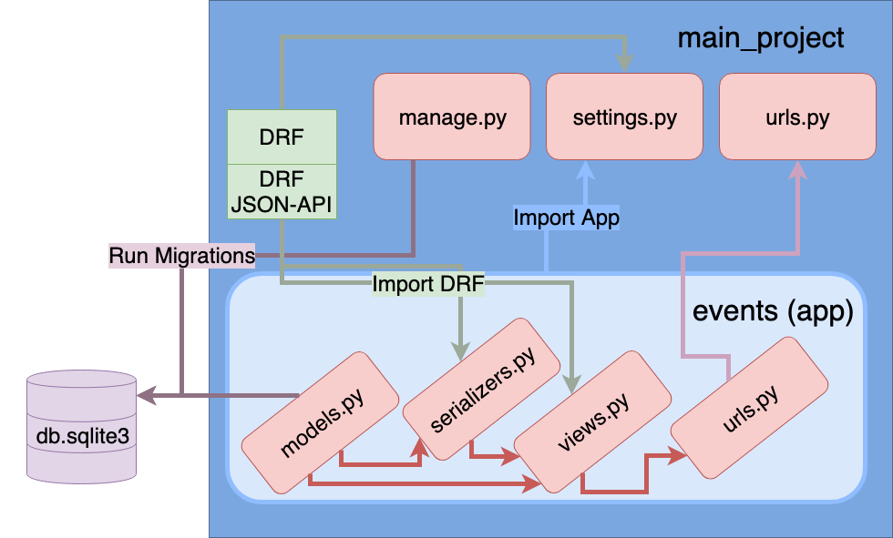
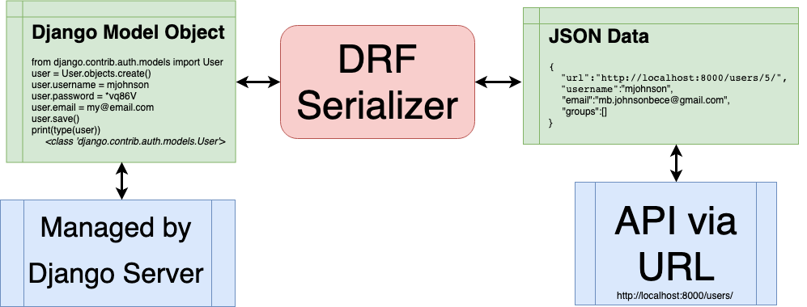

# Django Workshop
## Level 2: Custom Auth, Advanced Views, Templates and Heroku Deploy

<p style="font-size:50px; line-height:54px">Section 1: Main Workshop</p>

# 1 - Backend Startup

Create base folder: `mkdir django-workshop && cd django-workshop`

Create backend environment with packages 
- `mkdir events-backend && cd events-backend`
- `pip install pipenv`
- `pipenv install django djangorestframework`

Activate Backend Shell: `pipenv shell`

Start Django Project: `django-admin startproject main_project .`

(if you did not use the `.`, move into your project: `cd main_project`)

Create Events App: `python manage.py startapp events`

Create Users App (for custom model): `python manage.py startapp users`

We can start the server: `python manage.py runserver`

But we can't really do anything yet 😎

## Housekeeping

### Make Git Ignore

Create a file in the root directory:
    .gitnignore
    
Place the contents from this URL:
https://www.gitignore.io/api/django

### Inject Apps into `main_project`

```python
INSTALLED_APPS = [
    'django.contrib.admin',
    'django.contrib.auth',
    'django.contrib.contenttypes',
    'django.contrib.sessions',
    'django.contrib.messages',
    'django.contrib.staticfiles',
    # import rest_framework for viewset and serializer helpers
    'rest_framework',
    # add `events` application to main project
    'events',
    # add `users` application to main project
    'users',
]
```

# COMMIT 1

Start project and application (events and users). Import apps and DRF into main_project settings.

# 2 - Create Custom Auth Model (optional)

Django ships with a User model for authentication, however the official Django documentation highly recommends using a custom user model. Why? If you want to make any changes to the User model down the road, using a custom user model from the beginning makes this quite easy. If you do not, updating the default User model in an existing Django project is very, very challenging.

Example directions to help do this:
- [Simple](https://wsvincent.com/django-custom-user-model-tutorial/)
- [More Advanced](https://testdriven.io/blog/django-custom-user-model/)

## Create Custom Model
Navigate to `/users/models.py` and create the following class:

```python
    from django.contrib.auth.models import AbstractUser
    from django.db import models


    class CustomUser(AbstractUser):
        workplace = models.CharField(max_length=256, blank=True, null=True)
        contributor = models.BooleanField(blank=True, null=True)
```

## Create Forms for Custom Model
We need to create two forms that make heavy use of the user model. Create the file `/users/forms.py` and add the following:

```python
from django import forms
from django.contrib.auth.forms import UserCreationForm, UserChangeForm
from .models import CustomUser

class CustomUserCreationForm(UserCreationForm):
    class Meta(UserCreationForm):
        model = CustomUser
        fields = ("username", "email")


class CustomUserChangeForm(UserChangeForm):
    class Meta:
        model = CustomUser
        fields = ("username", "email")
```

## Put the custom form in the Django Admin

Go to `/users/admin` and import the forms and model. Note that the fieldsets are not required. We can use the default fieldsets, but our custom fields (workplace and contributor) will not be included in the forms. If we want to add these to the django admin, however, we can add them along with all the normal fieldsets that comes with the base UserModel.

```python
from django.contrib import admin
from django.contrib.auth import get_user_model
from django.contrib.auth.admin import UserAdmin
from django.utils.translation import gettext, gettext_lazy as _

from .forms import CustomUserCreationForm, CustomUserChangeForm
from .models import CustomUser

class CustomUserAdmin(UserAdmin):
    add_form = CustomUserCreationForm
    form = CustomUserChangeForm
    model = CustomUser
    list_display = ["username", "email"]
    # fieldsets = (
    #     (
    #         ("General Info"),
    #         {
    #             "fields": (
    #                 "username",
    #                 "password",
    #                 "workplace",
    #                 "contributor"
    #             )
    #         }
    #     ),
    #     (
    #         _("Personal Info"),
    #         {
    #             "fields": (
    #                 "first_name",
    #                 "last_name",
    #                 "email"
    #             )
    #         }
    #     ),
    #     (
    #         _("Permissions"),
    #         {
    #             "fields": (
    #                 "is_active",
    #                 "is_staff",
    #                 "is_superuser",
    #                 "groups",
    #                 "user_permissions",
    #             )
    #         },
    #     ),
    #     (
    #         _("Important dates"),
    #         {
    #             "fields": (
    #                 "last_login",
    #                 "date_joined"
    #             )
    #         }
    #     ),
    # )

admin.site.register(CustomUser, CustomUserAdmin)
```

## Add custom user model in settings.py

Add the line below the `INSTALLED_APPS` block in the `main_project/settings.py` file. This will tell django to use your custom model instead of the default baked in auth model

```python
INSTALLED_APPS = [
    ...
]

AUTH_USER_MODEL = 'users.CustomUser' # assign custom model
```

## Migrate

Migrate the DB with the new custom user model (or the baked in user model if you decided to skip #2) 

`python manage.py makemigrations`

`python manage.py migrate`

# COMMIT 2

Implement custom user model

### Django Admin
Think of the Django Admin as your CMS and user management portal. To use it we need to first create a super user.

Create a super user: `python manage.py createsuperuser`

Enter information required and then startup server: `python manage.py runserver`

Navigate to the admin URL: http://localhost:8000/admin

Log in with your login credentials. Test the admin interface by doing the following:

1. Create another user
2. Edit the user information 
3. Uncomment the fieldsets code from above and check out how the edit form changes
4. Test out deleting or moving fields between groups to see how it changes the admin

### We end up with a file structure like this:

```
▾ events/
  ▸ migrations/
  - __init__.py
  - admin.py
  - apps.py
  - models.py
  - tests.py
  - views.py
▾ users/                       
  ▸ migrations/                
  - __init__.py                
  - admin.py                   
  - apps.py                    
  - forms.py                   
  - models.py                  
  - tests.py                   
  - views.py  
▾ main_project/
  - __init__.py
  - settings.py
  - urls.py
  - wsgi.py
- manage.py
- Pipfile
- Pipfile.lock
```

# Overview of Backend




## Building Model, Serializer, View and URL for Events

To build an API endpoint (URL to GET, POST, PUT and DELETE) we will do the following:

1. Create our new model (and make migrations)
2. Register Locations in Django Admin
3. Create a serializer for events
4. Create views for our events
5. Route up our URLs to our views

# 3 - Create Event Model

## Create our Events Model

Add the following code to: `/events/models.py`

```python
from django.db import models
from django.utils import timezone
from django.contrib.auth import get_user_model

# basic information for our events 
class Event(models.Model):
    # Only required field is title
    title = models.CharField(max_length=256)
    presenter = models.ForeignKey(
      get_user_model(),
      on_delete=models.SET_NULL,
      null=True,
      blank=True,
    )
    # Default time is now if not provided
    time = models.DateTimeField(default=timezone.now)
    location = models.CharField(max_length=256, blank=True)
    description = models.TextField(blank=True)
```

## And migrate the database:

To checkout what will happen in a migration before you run it, run the command: 

`python manage.py makemigrations --dry-run --verbosity 3`

Then actually make migrations and migrate:

`python manage.py makemigrations`

`python manage.py migrate`

Finally, you can check the SQL that was run in a migration using the following command:

`python manage.py sqlmigrate polls 0001`

# 4 - Explore Django Admin

## Django Admin Reprise
### Register Events Model in Admin

Navigate to: `/events/admin.py` and add the following code to register our model in our django admin:

```python
from django.contrib import admin
from .models import Event

class EventAdmin(admin.ModelAdmin):
    list_display = ('title', 'presenter', 'time', 'location')

admin.site.register(Event, EventAdmin)
```

### Create Superuser

`python manage.py createsuperuser`

Enter information required and then startup server:

`python manage.py runserver`

Log in with your login credentials. Test the admin interface by doing the following:

1. Create two new events
2. Create a new user
3. Edit those user permissions so they (1) are staff and (2) can create and view events
4. Log out, then log in as that user
5. Notice that you can view, but not edit the events you created
6. Create an event. Notice create and view events is all you can do.
7. Log back in as your superuser and edit some events

# COMMIT 3

Create events model. Add events to django admin.

# 5 - Event Serializer, View and URLs (Headless CMS)

## Make Serializer for Events

Create the file `/events/serializers.py` file in events and create serializer:

```python
from django.contrib.auth.models import Group
from django.contrib.auth import get_user_model
from .models import Event
from rest_framework import serializers


# serializers to convert from Django model objects to JSON
class UserSerializer(serializers.HyperlinkedModelSerializer):
    class Meta:
        model = get_user_model()
        fields = ('url', 'username', 'email', 'groups')

# or specify all fields
class EventSerializer(serializers.ModelSerializer):
    class Meta:
        model = Event
        fields = '__all__'
```

## Creating a View for our Events

Navigate to the `views.py` file in our events app. Create viewsets:

```python
from django.contrib.auth import get_user_model
from rest_framework import viewsets
from .models import Event
from .serializers import UserSerializer, EventSerializer


class UserViewSet(viewsets.ModelViewSet):
    """
    API endpoint that allows users to be viewed or edited.
    """
    queryset = get_user_model().objects.all().order_by('-date_joined')
    serializer_class = UserSerializer

class EventViewSet(viewsets.ModelViewSet):
    """
    API endpoint that allows groups to be viewed or edited.
    """
    resource_name = 'events'
    queryset = Event.objects.all().order_by('-time')
    serializer_class = EventSerializer
```

## Connecting our URLs

In `api/urls.py`, register the EventViewSet and the UserViewSet

```python
from django.urls import include, path
from django.contrib import admin
from rest_framework import routers
from events import views

router = routers.DefaultRouter()
router.register(r'users', views.UserViewSet)
router.register(r'events', views.EventViewSet)

urlpatterns = [
    path('api/', include(router.urls)),
    path('admin/', admin.site.urls),
]
```

## Start Server and Witness the Magic DRF API

Run: `python manage.py runserver`

Navigate to Events API: http://localhost:8000/api/events/

Play around and try using the GUI provided for free from DRF to Create, Edit, Update and Delete events! Try the following:

1. Create two new events
2. Create a new user
3. Edit the original events to have the new users

# COMMIT 4

Create backend API endpoint for events

# Overview of Backend


# 6 - Event Templates and Views (Full Stack CMS)

## Making Template (human viewable HTML)

### Directory structure

The file structure for django is specific, and if you place files in the right places, django will automatically pick them up. This is especially true with templates. Create a directory inside the events app: `templates` and a folder within that: `events`. In the end, your file tree will look like: `events/templates/events`

In the `templates` folder create the file `base.html`. Then, in the `events` folder create create a `index.html`. In the end your file structure within events should look like this:

```
▾ events/                      
| ▸ migrations/                
| ▾ templates/                 
| | - base.html                 
| | ▾ events/                   
|   | - index.html               
| - __init__.py                
| - admin.py                   
| - apps.py                    
| - models.py                  
| - serializers.py             
| - tests.py                   
| - urls.py                    
| - views.py                   
```

### Webpage shell in Base.html

The base.html serves as a general `index` file that all our children will inherit from. We can do things in this file like loading styles, writing JavaScript, create a common UI shell and navigation scheme, etc. For now, lets just import bootstrap for styling (feel free to get the latest version of bootstrap if 4.1.3 is behind). 

Add the following to `events/templates/base.html`:

```html
<!DOCTYPE html>
<html lang="en">
  <head>
    <meta charset="utf-8" />
    <meta
      name="viewport"
      content="width=device-width, initial-scale=1, shrink-to-fit=no"
    />
    <link
      rel="stylesheet"
      href="https://stackpath.bootstrapcdn.com/bootstrap/4.1.3/css/bootstrap.min.css"
      integrity="sha384-MCw98/SFnGE8fJT3GXwEOngsV7Zt27NXFoaoApmYm81iuXoPkFOJwJ8ERdknLPMO"
      crossorigin="anonymous"
    />
    <title>Our Events</title>
  </head>
  <body>
    <div class="container">
      <div class="row justify-content-center">
        <div class="col-8">
          <h1 class="display-2">Events</h1>
          <hr class="mt-0 mb-4" />
           
        </div>
      </div>
    </div>
  </body>
</html>
```

### List View in Index.html
We're going to approach this backwords: building HTML, hooking up a URL to a View, then loading data into a View. You'll see in the index.html that we are taking the events, iterating through them and displaying information about each event. Add to the file `events/templates/events/index.html`:

```html
 
  
    <div class="card mb-3">
      <div class="d-flex justify-content-between align-items-center card-header p-3 lead">
        {{ event.title }}
      </div>
      <ul class="list-group list-group-flush list-group-item-action">
        <li class="list-group-item p-1 pl-3">Who: {{ event.presenter }} </li>
        <li class="list-group-item p-1 pl-3">What: {{ event.description }}</li>
        <li class="list-group-item p-1 pl-3">Where: {{ event.location }}</li>
        <li class="list-group-item p-1 pl-3">When: {{ event.time }}</li>
      </ul>
    </div>
  


```

## Setting Up View and URL
### Creating Views to Pull Events Data
In Django - views are the "controller" in the classic Model View Controller (MVC) paradigm. The views are where the data gets pulled from the database (via the ORM) and can then be passed into the template via a URL configuration. Add the following view to `events/views.py`:

```python
from rest_framework import viewsets
from django.contrib.auth.models import Group
from django.contrib.auth import get_user_model
from .models import Event
from .serializers import UserSerializer, EventSerializer
from rest_framework import serializers
from django.shortcuts import render # new

def listTemplateView(request): # new
    events = Event.objects.all() # new
    return render(request, "events/index.html", {"events": events}) # new

# serializers to convert from Django model objects to JSON
class UserSerializer(serializers.HyperlinkedModelSerializer):
    class Meta:
        model = get_user_model()
        fields = ('url', 'username', 'email', 'groups')

# or specify all fields
class EventSerializer(serializers.HyperlinkedModelSerializer):
    class Meta:
        model = Event
        fields = '__all__'
```

### Creating URL for index.html
We are going to create a URL conf that hooks together our listTemplateView with the base URL of events by

1) Creating a `events/urls.py` file and adding the following:
```python
from django.urls import path

from . import views

app_name = "events"
urlpatterns = [
    path("", views.listTemplateView, name="list"),
]
```

2) Adding the events URLs to `main_project/urls.py`:
```python
from django.urls import include, path
from django.contrib import admin
from rest_framework import routers
from events import views

router = routers.DefaultRouter()
router.register(r"users", views.UserViewSet)
router.register(r"events", views.EventViewSet)

urlpatterns = [
    path("api/", include(router.urls)),
    path("admin/", admin.site.urls),
    path("events/", include("events.urls")),
]
```

### Checkout the List View
You can run your local server: `python manage.py runserver`

Then navigate to the URL to check out the list view: `http://localhost:8000/events/`

# COMMIT 5

Create list view template for django as fullstack

<p style="font-size:50px; line-height:54px">Section 2: Bonus Material</p>

# 7 - Command Line Inspection of Model Objects vs Serialized Objects

# What's a serializer doin anyhow?!




### Test It Out

Let's take a look at what we created by using the python shell by running `python manage.py shell`. This is the basic python shell you would get by running `python` but`manage.py` sets the `DJANGO_SETTINGS_MODULE` variable, which gives Django the Python import path to your `api/settings.py` file.

Run the command: `python manage.py shell`

Once inside the shell, we can explore the model and creating instances:

```python
>>> from events.models import Event # import the model that we've created
>>> Event.objects.all() # objects is the manager for the model. Here we see we have no instances, unless you have created some in the previously. If you want the same result as below, you can delete all events first: Event.objects.all().delete()
      <QuerySet []>
>>> Event.objects.create(pk=20) # create an object. You do not need to assign the pk. We are doing so for consistency of this tutorial in case you already have events created
      <Event: Event object (20)>
>>> Event.objects.all() # confirm object is created. You may have other objects here if you created them previously.
      <QuerySet [<Event: Event object (20)>]>
>>> Event.objects.get(id=20) # get the object we created. Note that id and pk are interchangeable
      <Event: Event object (20)>
>>> event20 = Event.objects.get(pk=20) # assign instance to variable to we can edit it
>>> event20.id # access id
      20
>>> event20.title # title is blank
      ''
>>> event20.time # event time defaults to creation time
      datetime.datetime(2019, 8, 25, 18, 22, 38, 395955, tzinfo=<UTC>)
>>> event20.title = 'API Driven Design with Django Rest Framework' # set the title
>>> event20.location = 'LenderClose' # set the location
>>> Event.objects.get(id=20).title # notice the model hasn't actually changed yet
      ''
>>> event20.save() # save the event
>>> Event.objects.get(id=20).title # make sure changes persisted
      'API Driven Design with Django Rest Framework'
>>> Event.objects.create(pk=21) # create another instance
      <Event: Event object (21)>
>>> Event.objects.create(pk=22) # create another instance
      <Event: Event object (22)>
>>> Event.objects.all() # check that there are three objects
      <QuerySet [<Event: Event object (20)>, <Event: Event object (21)>, <Event: Event object (22)>]>
>>> Event.objects.filter(title='') # two events have blank title
      <QuerySet [<Event: Event object (21)>, <Event: Event object (22)>]>
>>> Event.objects.filter(title='API Driven Design with Django Rest Framework') # one event has the persisted title
      <QuerySet [<Event: Event object (20)>]>
```

Similar to how we used the django shell to investigate our model to create an instance of our model `Event`, we can use it to seralize it into a python native datatype. We can then further use the DRF class `JSONRenderer` to render our dictionary as JSON:

```python
>>> from events.models import Event # import our model
>>> from events.serializers import EventSerializer # import our serializer
>>> from rest_framework.renderers import JSONRenderer # import the class that will render to JSON
>>> events = Event.objects.all()
>>> events # confirm we still have data in the DB - otherwise make new ones
      <QuerySet [<Event: Event object (20)>, <Event: Event object (21)>, <Event: Event object (22)>]>
>>> event20 = list(filter(lambda x: x.pk == 20, events))[0] # find the event with pk of 20 and store as a variable
>>> print(event20) # event20 is a model object/instance
      Event object (20)
>>> event20.title # access event20 title as model instance
      'API Driven Design with Django Rest Framework'
>>> serializer1 = EventSerializer(event20) # serialize event20 to python native datatype
>>> print(serializer1)
      EventSerializer(<Event: Event object (1)>):
         id = IntegerField(read_only=True)
         title = CharField(max_length=256)
         presenter = CharField(allow_blank=True, max_length=256, required=False)
         time = DateTimeField()
         location = CharField(allow_blank=True, max_length=256, required=False)
         coordinator = CharField(allow_blank=True, max_length=256, required=False)
         description = CharField(allow_blank=True, max_length=256, required=False)
>>> print(serializer1.data) # serializer.data contains a dictionary with object data. If this fails, see the note below
      {'id': 20, 'title': 'API Driven Design with Django Rest Framework', 'presenter': 'Michael Johnson', 'time': '2019-01-30T22:11:57.487525Z', 'location': '', 'coordinator': '', 'description': ''}
>>> print(serializer1.data['title']) # access the title like you would a dictionary
      API Driven Design with Django Rest Framework
>>> content = JSONRenderer().render(serializer1.data) # render the data as JSON
>>> print(content) # print JSON as bytes
      b'{"id":20,"title":"API Driven Design with Django Rest Framework","presenter":"Michael Johnson","time":"2019-01-30T22:11:57.487525Z","location":"","coordinator":"","description":""}'
>>> print(content.decode("utf-8")) # can convert bytes to string
      {"id":20,"title":"API Driven Design with Django Rest Framework","presenter":"Michael Johnson","time":"2019-01-30T22:11:57.487525Z","location":"","coordinator":"","description":""}
>>> type(content.decode("utf-8"))
      <class 'str'>
```

**Note**: You may have wondered why in Section 4, we used a `HyperlinkedModelSerializer` for our the `User` model and a `ModelSerializer` for our `Event` model. This is because this command line tutorial will not work with the `HyperlinkedModelSerializer`. If you happened to make both with with the Hyperlinked version, you'll have gotten an error while accesseing `serializer.data`. Feel free to toggle the inherited class for the `Event` serializer between the hyperlinked form and the regular one. Can you figure out what changes this has on the API and why the hyperlinked version gives an error in this command line tutorial?

# 8 - Deploying Django to Heroku
[Example for using Postgres with Django on Heroku](https://medium.com/@qazi/how-to-deploy-a-django-app-to-heroku-in-2018-the-easy-way-48a528d97f9c)

Deploying django applications onto heroku is similar to other application. Follow these steps:

- If you don't have one, create an account at [Heroku.com](https://dashboard.heroku.com/)
- Install reququired packages: `pipenv install django-heroku gunicorn`
- Create file `Procfile` in the root directory and add to it: `web: gunicorn main_project.wsgi`
- Add to `settings.py`:
```python
import django_heroku 
# Then all the way at the bottom of the file
# ... 
django_heroku.settings(locals())
```

Before we continue we need to commit:

# COMMIT 6

Setup django application to deploy on Heroku

## Continue deployment
If you don't have the Heroku CLI, follow [these instructions](https://devcenter.heroku.com/articles/heroku-cli) or you can install on your mac with: `brew tap heroku/brew && brew install heroku`

Continue the deployment process:
- Login to heroku cli with the command: `heroku login`
- Create your application with the command: `heroku create`
- Make sure your commits are up today and push to heroku: `git push heroku master` similar to pushing to github remote
- After this finished, run migrations: `heroku run python manage.py migrate`
- If this doesn't work try the following debug tools
  - Check logs with: `heroku logs --tail`
  - See if you get errors spinning up web env locally: `heroku local web`
  
If all went well, you should be able to access your app online now. You should have received a `some-domain-####.herokuapp.com/` URL where your app is located. If you can't find this URL, go to your heroku.com dashboard and you'll find a URL to your app there.

Go ahead on try using the API to create users/events. You can also log on to the django admin or use your `/events` URL to view or share the frontend at your application.

**Hint**: Having trouble logging into the Django admin? You'll need to create a superuser first! Any command you run in django can be done from the commandline for Heroku (like we did above to migrate). Create a superuser by running the command: `heroku run python manage.py createsuperuser`

# 9 - Django Template and View for Create and Delete

## Create Template Add Events Form
### Install Crispy Forms
To show the power of Django and the open source community surrounding it, we are going to use "Crispy Forms" with bootstrap 4 to build up a quick create form.

Install crispy forms: `pipenv install django-crispy-forms`

Update the settings to import crispy forms and to use the bootstrap theme. In `main_project/settings.py`:

```python
INSTALLED_APPS = [
  ... truncated ...
    'crispy_forms',
]

CRISPY_TEMPLATE_PACK = 'bootstrap4'
```

### Views for Create form
Our create is a bit more complicated. It'll need to views: one to hook up the model and data for our form. The second is to handle the POST save of the event model to the DataBase.

Make the following updates to `events/views.py`:

```python
from rest_framework import viewsets
from django.contrib.auth.models import Group
from django.contrib.auth import get_user_model
from .models import Event
from .serializers import UserSerializer, EventSerializer
from rest_framework import serializers
from django.shortcuts import render
from django.urls import reverse
from django.views.generic import CreateView
from django.http import HttpResponseRedirect

class EventCreateView(CreateView):
    template_name = "events/add.html"
    model = Event
    fields = ("title", "presenter", "description", "location", "time")

def createTemplateView(request):
    if request.POST["presenter"]:
        presenter = get_user_model().objects.filter(pk=request.POST["presenter"])[0]
    else:
        presenter = request.user
    event = Event.objects.create(
        title=request.POST["title"],
        presenter=presenter,
        description=request.POST["description"],
        location=request.POST["location"],
    )
    return HttpResponseRedirect(
        reverse("events:list")
    )
    # want an extra challenge? Create a detail view
    # and see if you can get this redirect response to work:
    # return HttpResponseRedirect(
    #     reverse("events:details", kwargs={"event_id": event.pk})
    # )

def listTemplateView(request):
    events = Event.objects.all()
    return render(request, "events/index.html", {"events": events})

class UserViewSet(viewsets.ModelViewSet):
    """
    API endpoint that allows users to be viewed or edited.
    """
    queryset = get_user_model().objects.all().order_by('-date_joined')
    serializer_class = UserSerializer

class EventViewSet(viewsets.ModelViewSet):
    """
    API endpoint that allows groups to be viewed or edited.
    """
    resource_name = 'events'
    queryset = Event.objects.all().order_by('-time')
    serializer_class = EventSerializer
```

### URL Configuration for Create Form
To go with the two create views, we will create two URL confs. One for the actual URL we will access the add form at and the other is the POST URL. Update the file `events/urls.py`:

```python
from django.urls import path

from . import views

app_name = "events"
urlpatterns = [
    path("", views.listTemplateView, name="list"),
    path("create", views.createTemplateView, name="create"),
    path("add", views.EventCreateView.as_view(), name="add"),
]
```

### Crispy form in HTML Template
The form for the class based view we're going to use doesn't need much HTML. Create the file: `events/templates/add.html`:

```html
 
  <form action="" method="post">
    
    {{ form }}
    <button type="submit" class="btn btn-success">Save event</button>
  </form>

```

### Test Out the Create Form
You can run your local server: `python manage.py runserver`

Then navigate to the URL to check out the create form: `http://localhost:8000/events/add`

Doesn't look to great, huh? Let's spice it up by making it crispy: Add the `` tag and `{{ form | crispy }}` to the form to use the crispy form template:

```html
  
  <form action="" method="post">
    
    {{ form | crispy }}
    <button type="submit" class="btn btn-success">Save event</button>
  </form>

```

## Create Template Ability to Delete Events
### Creating a Delete Button
We're going to add a delete button in the index.html list view. We will follow the same flow of starting with the template and working towards the view and URL. Add the form in the card header for delete in the file `events/templates/events/index.html`:

```html
 
  
    <div class="card mb-3">
      <div class="d-flex justify-content-between align-items-center card-header p-3 lead">
        {{ event.title }}
        <form action="" method="post">
          
          <input type="hidden" value="{{ event.pk }}" name="pk" />
          <input class="btn btn-danger btn-lg float-right" type="submit" value="Delete Event" />
        </form>      </div>
      <ul class="list-group list-group-flush list-group-item-action">
        <li class="list-group-item p-1 pl-3">Who: {{ event.presenter }} </li>
        <li class="list-group-item p-1 pl-3">What: {{ event.description }}</li>
        <li class="list-group-item p-1 pl-3">Where: {{ event.location }}</li>
        <li class="list-group-item p-1 pl-3">When: {{ event.time }}</li>
      </ul>
    </div>
  

```

### Creating the Delete View
Django comes with some powerful class based views. We will utilize the `Delete` view. It needs to be suplied a model and a success_url. Also, we need to override the `get_object` method with the information from the post:

```python
from rest_framework import viewsets
from django.contrib.auth.models import Group
from django.contrib.auth import get_user_model
from .models import Event
from .serializers import UserSerializer, EventSerializer
from rest_framework import serializers
from django.shortcuts import render
from django.urls import reverse, reverse_lazy
from django.views.generic import CreateView, DeleteView
from django.http import HttpResponseRedirect

class EventCreateView(CreateView):
    template_name = "events/add.html"
    model = Event
    fields = ("title", "presenter", "description", "location", "time")

def createTemplateView(request):
    if request.POST["presenter"]:
        presenter = get_user_model().objects.filter(pk=request.POST["presenter"])[0]
    else:
        presenter = request.user
    event = Event.objects.create(
        title=request.POST["title"],
        presenter=presenter,
        description=request.POST["description"],
        location=request.POST["location"],
    )
    return HttpResponseRedirect(
        reverse("events:list")
    )
    # want an extra challenge? Create a detail view
    # and see if you can get this redirect response to work:
    # return HttpResponseRedirect(
    #     reverse("events:details", kwargs={"event_id": event.pk})
    # )

class EventDeleteView(DeleteView):
    model = Event
    success_url = reverse_lazy("events:list")

    def get_object(self, queryset=None):
        pk = self.request.POST["pk"]
        return self.get_queryset().filter(pk=pk).get()

def listTemplateView(request):
    events = Event.objects.all()
    return render(request, "events/index.html", {"events": events})

class UserViewSet(viewsets.ModelViewSet):
    """
    API endpoint that allows users to be viewed or edited.
    """
    queryset = get_user_model().objects.all().order_by('-date_joined')
    serializer_class = UserSerializer

class EventViewSet(viewsets.ModelViewSet):
    """
    API endpoint that allows groups to be viewed or edited.
    """
    resource_name = 'events'
    queryset = Event.objects.all().order_by('-time')
    serializer_class = EventSerializer
```

### Creating the Delete URL Configuration
Then create the post URL conf that connects the delete view and the button post:

```python
from django.urls import path
from . import views

app_name = "events"
urlpatterns = [
    path("", views.listTemplateView, name="list"),
    path("create", views.createTemplateView, name="create"),
    path("add", views.EventCreateView.as_view(), name="add"),
    path("delete", views.EventDeleteView.as_view(), name="delete"),
]
```

# Commit 7

Install Crispy forms. Create Delete and Add event templates

# 10 - Repeat Model, Serializer, View and URLs flow with Locations

## Wash, Rinse, Repeat: Building Model, Serializer, View and URL for Locations

To build an API endpoint (URL to GET, POST, PUT and DELETE) we will do the following:

1. Create our new model (and make migrations)
2. Register Locations in Django Admin
3. Create a serializer for locations
4. Create views for our locations
5. Route up our URLs to our locations

### Create our Locations Model

Update the following code in `/events/models.py` to look like:

```python
from django.db import models
from django.utils import timezone
from django.contrib.auth import get_user_model

class Location(models.Model):
    # Only required field is title
    name = models.CharField(max_length=256)
    company = models.CharField(max_length=256, blank=True)
    address = models.CharField(max_length=256, blank=True)
    contact_primary = models.ForeignKey(
      get_user_model(),
      on_delete=models.SET_NULL,
      null=True,
      blank=True,
      related_name="contact_primary"
    )
    contact_secondary = models.ForeignKey(
      get_user_model(),
      on_delete=models.SET_NULL,
      null=True,
      blank=True,
      related_name="contact_secondary"
    )
    description = models.TextField(blank=True)
    
    def __str__(self):
        return '{}'.format(self.name)


# basic information for our events
class Event(models.Model):
    # Only required field is title
    title = models.CharField(max_length=256)
    presenter = models.ForeignKey(
      get_user_model(),
      on_delete=models.SET_NULL,
      null=True,
      blank=True,
      related_name='events'
    )
    # Default time is now if not provided
    time = models.DateTimeField(default=timezone.now)
    location = models.ForeignKey(
      Location,
      on_delete=models.SET_NULL,
      null=True,
      blank=True,
      related_name='events'
    )
    description = models.TextField(blank=True)
```


### Register Location Model in Admin

Navigate to: `/events/admin.py` and add the following code to register our model in our django admin:

```python
from django.contrib import admin
from .models import Event, Location

class EventAdmin(admin.ModelAdmin):
    list_display = ('title', 'presenter', 'time', 'location')
class LocationAdmin(admin.ModelAdmin):
    list_display = ('name', 'company')

admin.site.register(Event, EventAdmin)
admin.site.register(Location, LocationAdmin)
```

### And migrate the database:

`python manage.py makemigrations`

`python manage.py migrate`

**Note that** if you've created events already and assigned values to locations, you'll receive an error similar to:
`django.db.utils.IntegrityError: The row in table 'events_event' with primary key '1' has an invalid foreign key: events_event.location_id contains a value 'LenderClose' that does not have a corresponding value in events_location.id.`

This is because we have the string 'LenderClose' in the `location`, and this is not a valid PK for our related field. There are several ways to deal with this. Here are some:

Easiest Method: 
- Go to base folder and delete the file: `db.sqlite3`
- Rerun makemigrations and migrate
- Pro: Very simple and easy
- Con: Losing all DB data, including all events and all users

Second Easiest:
- Use `git stash` to remove the migration file and the changes to the models
- Log into django admin
- Delete the events that have events assigned to them
- Pop the stashed changes with `git stash pop`
- Then rerun makemigrations and migrate

Method that Retains Data Integrity:
- Undo changes to `events.py` Event model (change location back to: `location = models.CharField(max_length=256, blank=True)`)
- Run makemigrations and migrate to create locations table in DB
- Log into django admin and create location(s) (note: first event created will have a pk=1, second event has pk=2, etc)
- Go to events that have locations and change them to numeric values for locations to be associated with the pks from above
- Change back the `events.py` Event model to have `location = models.ForeignKey(...`
- Rerun and makemigrations and migrate

This exercise helps us see why getting our database relationships structure right from the start helps from messy database changes down the line :)

### Make Serializer for Locations

Navigate to the file `/events/serializers.py` file update serializer. Additional to creating the Location serializer, we are creating some linked related serializer fields. This will allow us to get the events related to Users and Locations.

```python
from django.contrib.auth import get_user_model
from django.contrib.auth.models import Group
from .models import Event, Location
from rest_framework import serializers


# or specify all fields
class EventSerializer(serializers.HyperlinkedModelSerializer):
    class Meta:
        model = Event
        fields = '__all__'

# serializers to convert from Django model objects to JSON
class UserSerializer(serializers.HyperlinkedModelSerializer):
    # events = serializers.HyperlinkedRelatedField(
    #     many=True,
    #     read_only=True,
    #     view_name='event-detail'
    # )
    class Meta:
        model = get_user_model()
        # fields = ('url', 'first_name', 'last_name', 'username', 'email', 'events')
        fields = ('url', 'first_name', 'last_name', 'username', 'email')

class LocationSerializer(serializers.HyperlinkedModelSerializer):
    events = serializers.HyperlinkedRelatedField(
        many=True,
        read_only=True,
        view_name='event-detail'
    )
    class Meta:
        model = Location
        fields = ('url', 'name', 'company', 'address', 'contact_primary', 'contact_secondary', 'description', 'events')
```

Note that above we are adding `HyperlinkedRelatedField` to the Location serializer. This allows us to show a list of events for each location. Want an extra challenge? See if you can get it to work for users as well! In the end, we should see a list of event hyperlinks for each user.

### Creating a View for our Locations

Navigate to the `views.py` and update with the locations serializer at the bottom (don't forget to include the imports):

```python
from rest_framework import viewsets
from django.contrib.auth.models import Group
from django.contrib.auth import get_user_model
from .models import Event, Location
from .serializers import UserSerializer, EventSerializer, LocationSerializer
from rest_framework import serializers
from django.shortcuts import render
from django.urls import reverse, reverse_lazy
from django.views.generic import CreateView, DeleteView
from django.http import HttpResponseRedirect

class EventCreateView(CreateView):
    template_name = "events/add.html"
    model = Event
    fields = ("title", "presenter", "description", "location", "time")

def createTemplateView(request):
    if request.POST["presenter"]:
        presenter = get_user_model().objects.filter(pk=request.POST["presenter"])[0]
    else:
        presenter = request.user
    event = Event.objects.create(
        title=request.POST["title"],
        presenter=presenter,
        description=request.POST["description"],
        location=request.POST["location"],
    )
    return HttpResponseRedirect(
        reverse("events:list")
    )
    # want an extra challenge? Create a detail view
    # and see if you can get this redirect response to work:
    # return HttpResponseRedirect(
    #     reverse("events:details", kwargs={"event_id": event.pk})
    # )

class EventDeleteView(DeleteView):
    model = Event
    success_url = reverse_lazy("events:list")

    def get_object(self, queryset=None):
        pk = self.request.POST["pk"]
        return self.get_queryset().filter(pk=pk).get()

def listTemplateView(request):
    events = Event.objects.all()
    return render(request, "events/index.html", {"events": events})

class UserViewSet(viewsets.ModelViewSet):
    """
    API endpoint that allows users to be viewed or edited.
    """
    queryset = get_user_model().objects.all().order_by('-date_joined')
    serializer_class = UserSerializer

class EventViewSet(viewsets.ModelViewSet):
    """
    API endpoint that allows groups to be viewed or edited.
    """
    resource_name = 'events'
    queryset = Event.objects.all().order_by('-time')
    serializer_class = EventSerializer

class LocationViewSet(viewsets.ModelViewSet):
    """
    API endpoint that allows groups to be viewed or edited.
    """
    resource_name = 'locations'
    queryset = Location.objects.all().order_by('name')
    serializer_class = LocationSerializer
```

### Connecting Locations into our URLs

In `api/urls.py`, register the EventViewSet and the UserViewSet

```python
from django.urls import include, path
from django.contrib import admin
from rest_framework import routers
from events import views

router = routers.DefaultRouter()
router.register(r'users', views.UserViewSet)
router.register(r'events', views.EventViewSet)
router.register(r'locations', views.LocationViewSet)

urlpatterns = [
    path('api/', include(router.urls)),
    path('api-auth/', include('rest_framework.urls', namespace='rest_framework')),
    path('admin/', admin.site.urls),
]
```

# Commit 8

Create API functionality and API views for Locations

Want some extra fun? Check out these tuturials and using Vue and Django together:
- [Vue Embedded in Django Templates](https://medium.com/quick-code/crud-app-using-vue-js-and-django-516edf4e4217)
- [Vue and Django Talking Over Cross Origin API](https://ahackersday.com/blog/building-a-todo-app-using-vue-js-and-django-as-the-backend/)


```python

```
